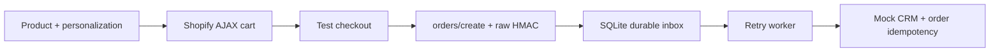

# Personalized Shopify interview demo

A development-store project for Anny's custom Shopify theme: choose a variant, personalize a gift, update an AJAX cart, place a test order, and deliver its personalization to a local mock CRM.

Branch: `interview-demo/personalized-products`, connected to live Shopify theme `167196295331` at commit `9bccf0b` (verified 2026-10-01 by Shopify CLI, Git remote, and Admin screenshot). No merge into `main`. The earlier CLI-only demo `167193444515` and pre-release backup `167195410595` remain unpublished.

[Live storefront](https://code-with-anny.myshopify.com/) | [Connected theme editor](https://code-with-anny.myshopify.com/admin/themes/167196295331/editor). Storefront password and live cart/checkout verification remain outstanding.

## Architecture

- Preserved Dawn-derived/ShopUS sections remain available for comparison. Default home/product/collection/cart/page templates use `layout/demo.liquid` and `sections/demo-*.liquid`.
- Named `product.personalized`, `collection.demo`, and `page.care` templates demonstrate reusable template assignments.
- `assets/demo.js` enhances native forms; Shopify remains authoritative for inventory, money, cart state, and checkout.
- `integration-app/` is an independent Node 24 backend using built-in HTTP, fetch, crypto, and SQLite. It has no runtime npm dependencies and needs no paid service.
- CLI uploads exclude backend/docs/tests through `.shopifyignore`. Shopify's GitHub integration ignores non-theme folders, so the demo branch can be connected directly; see the deployment guide.



## Local checks

From the root, use npm.cmd on Windows where npm.ps1 is blocked:

```powershell
npm.cmd ci
npx.cmd playwright install chromium
npm.cmd run check
npm.cmd test
npx.cmd --yes @shopify/cli theme check
```

Backend, from `integration-app`:

```powershell
node src/setup-local.js
npm.cmd start
```

In another terminal in that directory:

```powershell
npm.cmd run demo
npm.cmd run inspect
```

Health: http://127.0.0.1:3001/health . The CLI reads local authentication without printing tokens. Mock demo sends one signed simulated test order twice; inspection shows inbox results and CRM personalization. This does not prove Shopify checkout, authentication, or real webhook delivery.

## Setup and demonstration

Follow [store setup](docs/store-setup.md), [backend setup](integration-app/README.md), and [deployment](docs/deployment.md). The connected demo theme is already published. Create the care-guide metaobject definition before configuring the guide. Future theme-code changes pushed to this branch update the live theme, so use a review/preview branch and theme for further development.

Demonstrate: collection filtering -> variant price/image/availability -> two engravings on one variant -> drawer quantities/removal -> test checkout -> webhook inbox -> mock CRM. Use real development-store catalog data and a test payment gateway. Publication and Git mapping are verified; the end-to-end purchase/webhook flow is not yet verified.

## Learning guides

- [Inspection and architecture](docs/inspection.md)
- [Topic coverage with code links](docs/topic-coverage.md)
- [Modernization log](docs/modernization-log.md)
- [Debugging exercises](docs/debugging.md)
- [Independent practice](docs/practice.md)
- [Interview walkthrough](docs/interview-walkthrough.md)
- [Manual checklist](docs/verification.md)
- [Performance and SEO](docs/performance.md)
- [Optional checkout concepts](docs/checkout.md)
- [Validation results](docs/validation.md)

Browser tests execute actual demo JavaScript/CSS against simulated Shopify responses; they do not render Liquid in Shopify. Repository-wide Theme Check reports legacy issues separately. No Lighthouse scores or real-store success are claimed.

Use ordinary one-time-purchase products with no more than 250 variants. Selling plans, bundles, high-variant remote selection, multi-store OAuth, and production reconciliation are outside this demo. Storefront character limits are convenience validation, not server authorization. Only orders explicitly marked `test: true` are delivered to the CRM.

Original Shopify/Dawn attribution remains in [LICENSE.md](LICENSE.md).
